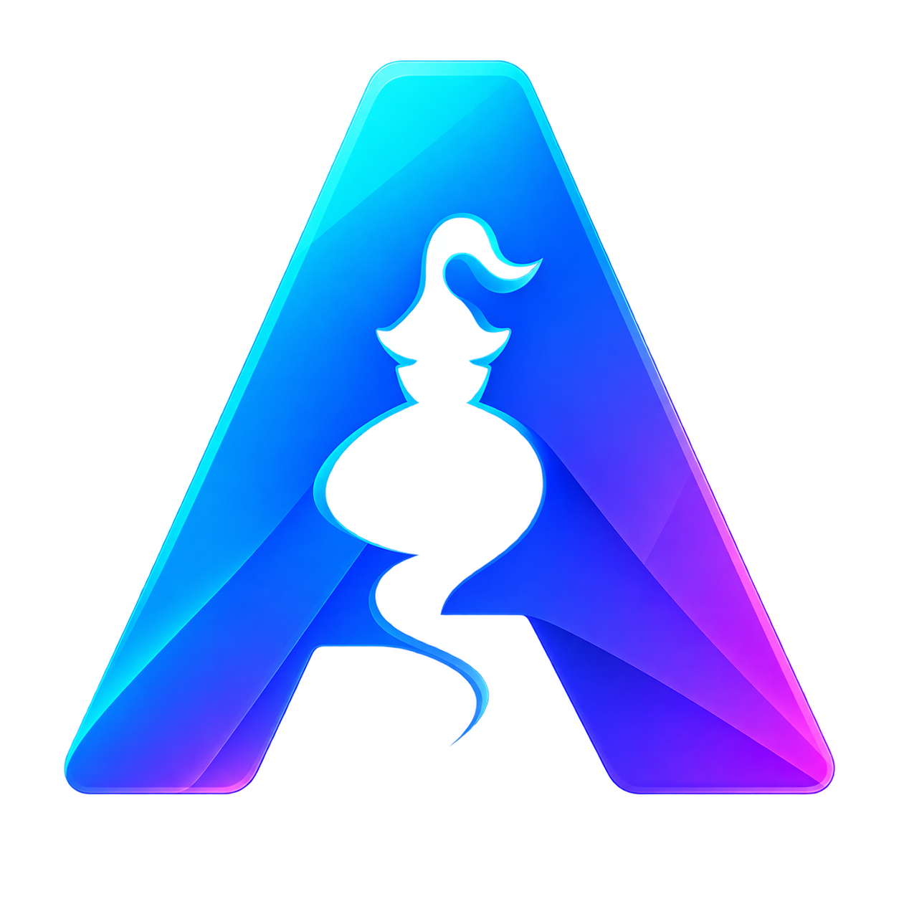
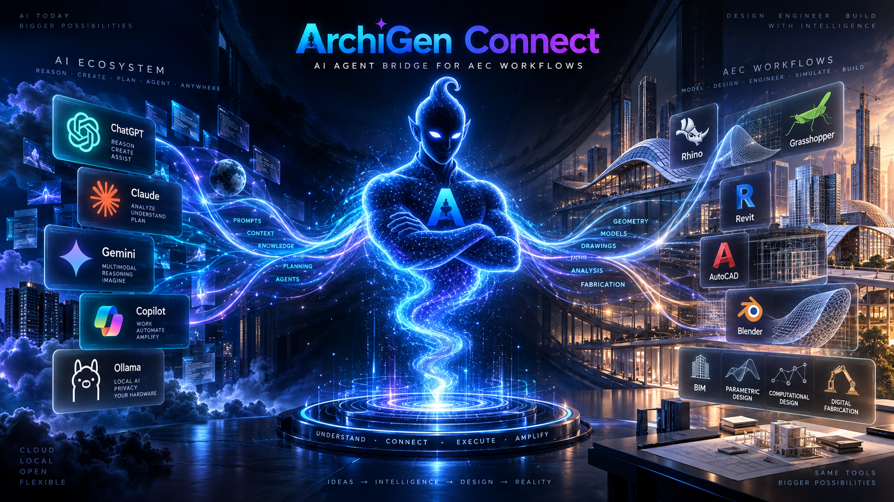
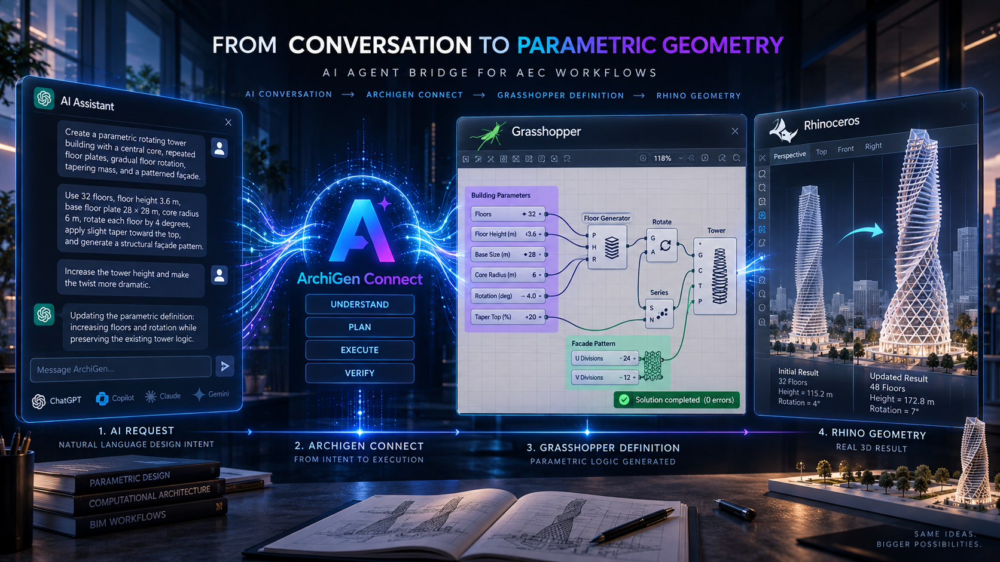
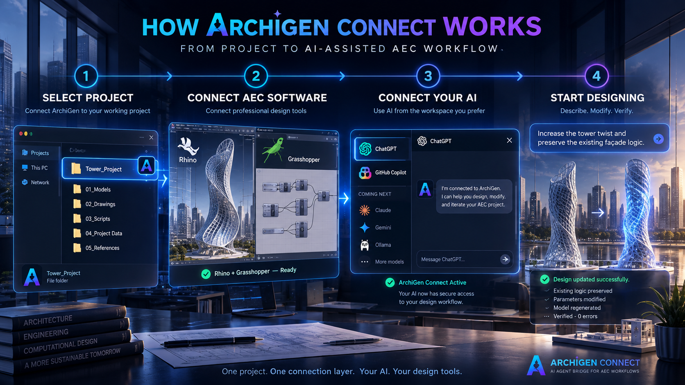
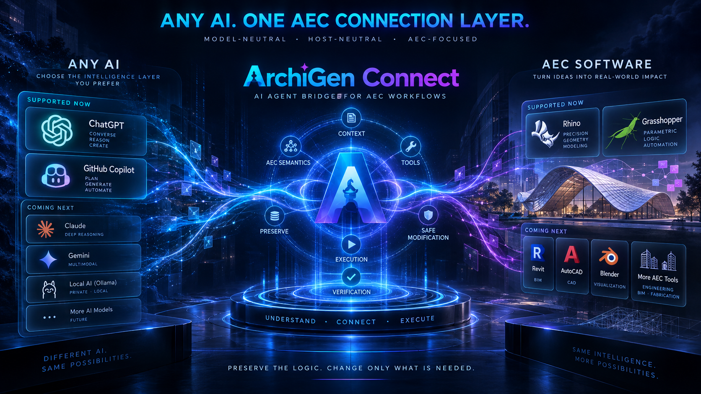

<p align="center"></p>

<h1 align="center">ArchiGen Connect</h1>

<p align="center"><strong>AI Agent Bridge for AEC Workflows</strong></p>
<p align="center">Connect AI directly to Rhino, Grasshopper, and professional AEC workflows.</p>
<p align="center"><code>MCP-powered</code> · <code>Model-neutral</code> · <code>AEC-focused</code></p>

<p align="center">
	<a href="https://github.com/ArchiGenio/archigen-connect/releases/tag/v0.1.0-beta.15"><strong>Download Latest Beta</strong></a>
	· <a href="https://github.com/ArchiGenio/archigen-connect/issues/new/choose">Report Feedback</a>
</p>

<p align="center"><strong>Free Public Beta</strong></p>

<p align="center"></p>

ArchiGen Connect is the intelligent connection layer between AI assistants and professional architecture, engineering, computational-design, CAD, parametric-design, and BIM workflows. It is not another foundation model. It gives compatible AI systems structured tools, project context, AEC semantics, execution, modification, and verification.

```text
AI Intelligence
			↓
ArchiGen Connect
			↓
AEC Execution
```

## Supported now

| AI clients and hosts | AEC software | Platform |
| --- | --- | --- |
| ChatGPT · GitHub Copilot / local workflow | Rhino · Grasshopper | Windows 10/11 x64 |

## From conversation to parametric geometry

<p align="center"></p>

Describe → Understand → Execute → Modify → Verify

For example, describe a rotating tower with editable floor count, floor height, twist, taper, core dimensions, and facade controls. ArchiGen Connect helps turn that intent into a structured workflow, then supports measured changes and verification. The illustration above is conceptual, not a product screenshot.

## What you can do

- **CREATE** — Generate structured parametric and AEC workflows.
- **MODIFY** — Change existing definitions and geometry instead of blindly rebuilding.
- **INSPECT** — Understand graph and geometry state before mutation.
- **VERIFY** — Solve, inspect, detect errors, and confirm the resulting output.

Workflows also support safe bounded cleanup, parameterized evolution, and preserving unrelated user work.

## How ArchiGen Connect works

<p align="center"></p>

1. Select your project.
2. Connect supported AEC software.
3. Connect your AI.
4. Start designing.

For the current Beta, Rhino and Grasshopper are the primary supported AEC workflow.

## Platform vision

<p align="center"></p>

```text
ANY AI
	↓
ARCHIGEN CONNECT
	↓
AEC SOFTWARE
```

ArchiGen Connect is **model-neutral**, **host-neutral**, and **AEC-focused**.

**Supported now:** ChatGPT, GitHub Copilot, Rhino, Grasshopper.

**Coming next:** Claude, Gemini, local AI, Revit, AutoCAD, Blender, and more AEC workflows. These are roadmap items, not current production support.

## MCP-Powered AEC Connectivity

ArchiGen Connect uses the Model Context Protocol (MCP) as part of its connection layer, allowing compatible AI clients to discover and invoke structured AEC actions. ArchiGen adds the product-specific layer around MCP: AEC semantics, project context, safe modification, execution, and verification.

This makes ArchiGen Connect an AEC Agent and AI Agent bridge for Rhino MCP, Grasshopper MCP, Parametric Design, and Computational Design workflows.

## Example prompts

```text
Create a Grasshopper circle with an editable radius of 8.
```

```text
Create a parametric rotating tower with editable floor count, floor height,
twist, taper, core dimensions, and facade controls.
```

```text
Modify the existing definition to increase the tower twist. Preserve the
existing floor-generation and facade logic.
```

```text
Inspect the current definition and identify only obsolete components.
Preserve unrelated user-created work.
```

## Installation

Download → Install → Sign In → Select Project → Connect → Design

See [INSTALL.md](INSTALL.md) for the complete setup flow and [REQUIREMENTS.md](REQUIREMENTS.md) for supported prerequisites.

## Connect with ChatGPT

ChatGPT connects to ArchiGen Connect through MCP using the Beta.15 Developer Mode app flow. Follow the complete [ChatGPT MCP setup guide](CHATGPT_SETUP.md) for the bridge command, secure HTTPS tunnel, tool scan, status test, and first Grasshopper execution test.

## Download Beta.15

Download the latest **ArchiGen Connect Public Beta** for Windows.

[**Download ArchiGen Connect 0.1.0-beta.15**](https://github.com/ArchiGenio/archigen-connect/releases/tag/v0.1.0-beta.15)

The installer is distributed through the official GitHub Releases page.

For installation steps, see [INSTALL.md](INSTALL.md).

SHA-256: `6C910296DEAC44E4D16A2ABF517C4DDD968537C18E9389F17DAAD631CC2734A6`

## Roadmap

**Now:** ChatGPT, GitHub Copilot, Rhino, Grasshopper, and create / modify / inspect / verify workflows.

**Coming next:** Claude, Gemini, local / Ollama workflows, Revit, AutoCAD, and Blender.

**Later:** Project Memory, broader multi-software AEC workflows, and cross-software workflows.

No speculative dates are published.

## Public Beta and feedback

This is a public Beta. Start with [installation](INSTALL.md) or [troubleshooting](TROUBLESHOOTING.md), then use [GitHub Issues](https://github.com/ArchiGenio/archigen-connect/issues/new/choose) for bug reports and feature requests.

Do not submit passwords, tokens, API keys, confidential project files, or private company information in GitHub Issues.
